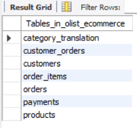
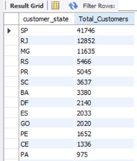
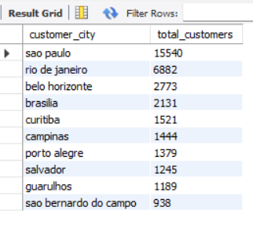
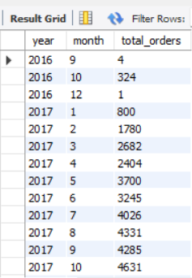
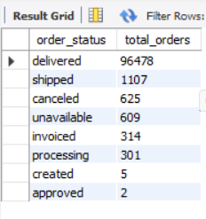
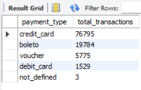
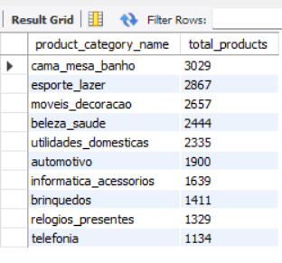
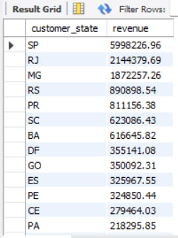
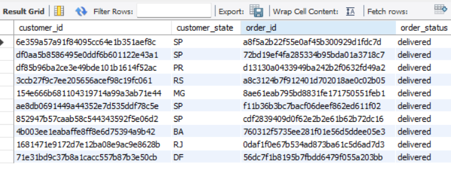

# 📊 Task 3 - SQL Data Analysis using MySQL

## 📌 Project Overview

This project demonstrates SQL-based data analysis using the Brazilian E-Commerce (Olist) dataset. The objective is to explore and analyze customer behavior, order trends, payment methods, product categories, and revenue using MySQL.

The project showcases practical SQL skills including data exploration, aggregation, joins, views, and indexing to generate meaningful business insights.

---

## 🎯 Objectives

- Import and validate relational data in MySQL
- Perform exploratory data analysis (EDA)
- Analyze customer distribution across states and cities
- Analyze order status and monthly order trends
- Analyze payment methods and revenue
- Explore product category distribution
- Create SQL Views and Indexes
- Generate business insights using SQL

---

## 🛠 Tools & Technologies

- MySQL Workbench
- SQL
- Python (Pandas & SQLAlchemy) – Used only for importing CSV files into MySQL

---

## 📂 Dataset

**Dataset:** Brazilian E-Commerce Public Dataset by Olist

Due to GitHub file size limitations, the dataset is not included in this repository.

You can download it from Kaggle:

https://www.kaggle.com/datasets/olistbr/brazilian-ecommerce

---

## 📚 SQL Concepts Used

- SELECT
- WHERE
- GROUP BY
- ORDER BY
- LIMIT
- COUNT()
- SUM()
- AVG()
- DISTINCT
- INNER JOIN
- CREATE VIEW
- CREATE INDEX

---

## 📈 Business Questions Answered

- How many customers are present in each state?
- Which cities have the highest number of customers?
- What is the distribution of order statuses?
- How do monthly orders change over time?
- Which payment methods are used most frequently?
- Which product categories have the highest number of products?
- Which states generate the highest revenue?

---

# 📷 Project Outputs

## Database Tables



---

## Customers by State



---

## Top 10 Customer Cities



---

## Monthly Orders



---

## Order Status Distribution



---

## Payment Methods



---

## Product Categories



---

## Revenue by State



---

## View Output



---

## 📁 Repository Structure

```
Task-3-SQL-Data-Analysis
│
├── SQL
│   └── sql_analysis.sql
│
├── Monthly_orders.png
├── Revenue_by_state.png
├── TABLES.png
├── customers_by_state.png
├── order_status.png
├── payment_methods.png
├── product_categories.png
├── top_10_customer_cities.png
├── view_output.png
│
└── README.md
```

---

## 📌 Key Insights

- São Paulo has the highest customer concentration.
- Customer distribution varies significantly across Brazilian states.
- Most orders were successfully delivered.
- Credit Card is the most frequently used payment method.
- Revenue differs across customer states.
- Product availability varies by category.

---

## 🚀 Learning Outcomes

Through this project, I gained hands-on experience in:

- Writing SQL queries for business analysis
- Working with relational databases
- Applying aggregate functions
- Performing JOIN operations
- Creating Views and Indexes
- Extracting business insights using SQL
- Organizing SQL projects for GitHub

---

## 👩‍💻 Author

**Mamidi Shirisha**

Aspiring Data Analyst

**Skills:** SQL • Python • Power BI • Excel • Data Visualization
